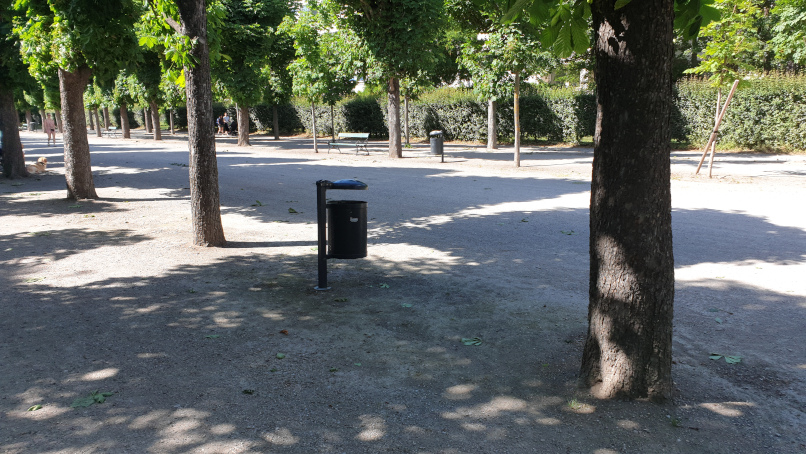
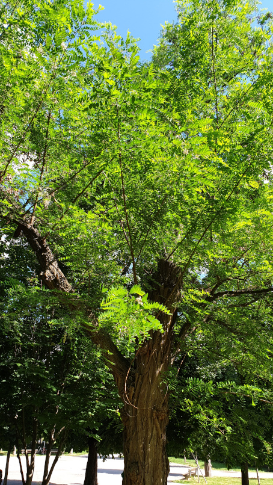
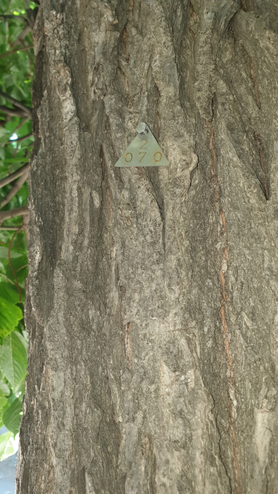
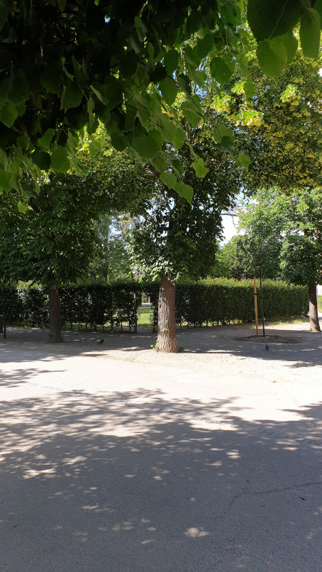
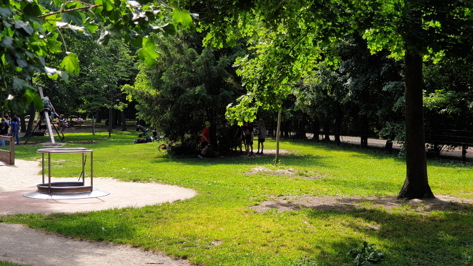
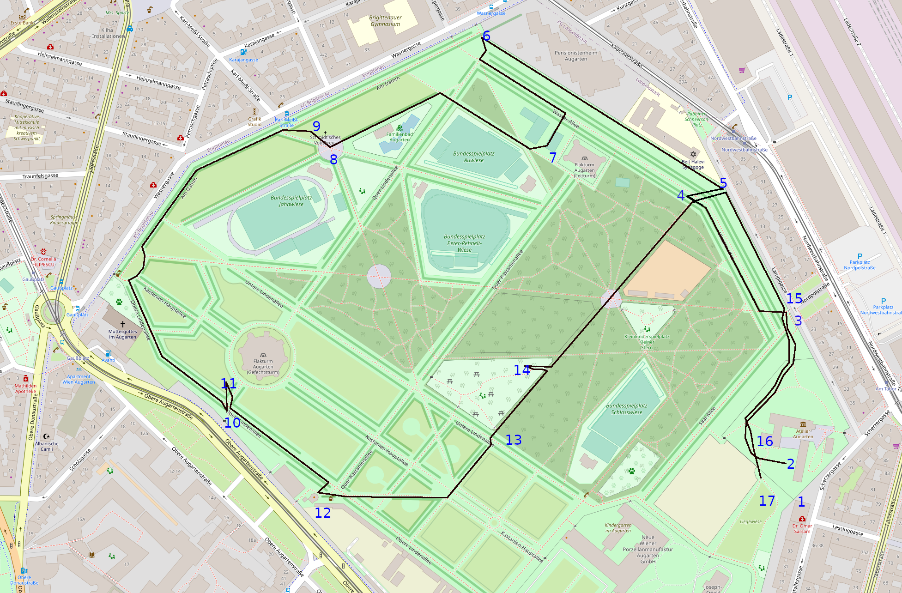

# Schnitzeljagt Augarten Wien

Ziel der Jagt ist es ein Nummernschloss zu öffnen (Schatzkiste).

* ca 3km, 
* dauer 1h
* ab 10 Jahre
* ca 14 Stationen

Die Schnitzel
* [DieSchnitzelAugarten.odt](OpenOffice)
* [DieSchnitzelAugarten.pdf](PDF)

Gebraucht wird:

* Kompass
* Tau für Seilziehen
* Massband oder Meterstab 
* Geld für Eis

1. Übergabe einer Schatzkiste mit Nummernschloss und Hinweis 1
2. Am oder beim Baum Hinweis 2
3. Beim Eingangstor im Sand das Maßband/Meterstab mit Hinweis 3 vergraben
4. Beim Baum (3 Reihe Baum 27) einen Kompass verstecken oder mit den Personen um einen Kompass spielen (Federball, Dosen werfen, ...)

5. Hinweis bei der Wand verstecken
6. Hinweis bei Fahrradständer verstecken
7. Hinweis in der westlichen Ecke des Sandplatzes Verstecken
8. Hinweis beim Kreuz mit Baum-Blätterbeschreibung
9. Hinweis bei der Esche verstecken

10. Hinweis beim Schild die Zahlen am Hinweis gehören zur Baumnummerierung in Wien. Schräg gegenüber gibt es den Baum [2; 0 7 0]

11. Hinweis mit etwas Geld für die Schankwirtschaft bei einem Baum hinter dem Baum [2; 0 7 0] verstecken.

12. Dem Wirt fragen ob er einen Hinweis ausgibt (Dort wo sich die Gießkanne des Gärtners füllt.) damit ist die Tankfüllanlage neben dem Spielplatz gemeint
13. Bei der Tankfüllanlage (Der Hinweis soll zum Karussell am Spielplatz leiten)

14. Hinweis bei der Hecke neben den Stiegen
15. Hinweis bei der Großen Platane beim Lokal
16. Tauziehen
17. 8-9+6 am Kopf betrachten `9+6-8=7`
19. Der Code ist am letzten Zettel den aber nicht ausgeben

